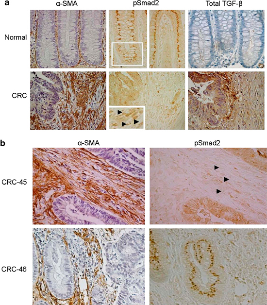

<!-- Limit image width and height -->

<!-- Center image on slide -->

<!-- Italic -->

<!-- Bold -->

--- .segue .dark .nobackground

## Recap

---

## Genoomiterviklikkuse kontroll

- Epiteeli struktuur minimeerib geenikahjustusi.
    - Koes kõige seespool asub tüvirakunišš.
    - Soole mukoosa kaitseb toksiinide/mutageenide eest.
- Raku toksiinipumbad (P-glükovalk, Pgp)
- Tüviraku nišš ei jagune intensiivselt.
- Biokeemilised DNA reparatsioonimehhanismid: MMR, BER, NER.
- Kahjustuste tolereerimismehhanismid, et vältida genoomi ebastabiilsust (*translesion DNA synthesis*).

--- .segue .dark .nobackground

## Vähi mikrokeskkond: strooma

---- &twocol

## Vähi mikrokeskkond

Kasvajarakud ei eksisteeri organismis isoleeritult, neid ümbritseb kompleksne keskkond, mis koosneb:

***=left

- normaalsetest rakkudest,
- sekreteeritud valkudest,
- füsioloogilistest madalmolekulaarsetest ühenditest (hormoonid),
- veresoontest.

***=right

<footer class="source">Pilt: Nature.com
</footer>

--- &twocol

## Kasvajad sisaldavad suures mahus strooma rakke

***=left

- Vasemal: E-kadheriini antikehaga värvitud rinnavähi koelõigud. E-kadheriini ekspresseerivaid vähirakke ümbritseb rohkelt stroomarakke.  
- Parem: anti-PINCH-positiivne tuumoriga assotseerunud strooma (TAS)

***=right

<footer class="source">Pildid: 
<a href="http://onlinelibrary.wiley.com/doi/10.1002/cncr.11332/full">Gupta et al., 2003
</a>
ja 
<a href="http://onlinelibrary.wiley.com/doi/10.1002/cncr.10878/full">Wang-Rodriguez et al., 2002.
</a>
</footer>

***=pnotes
PINCH/LIMS2 on ekspresseeritud kasvajate stroomas.
- (A) Normaalne eesnääre ja (B) eesnäärme kartsinoom. 
- (C) Käärsool ja käärsoole kartsinoom. 
- (D) Käärsoole kartsinoomi suurendus, PINCH-positiivsed rakud on fibroblastoidse morfoloogiaga. 
- (E) Normaalne nahk. E, epidermis; F, karvafolliikul; D, strooma fibroblastid.  
- (F) Lamerakuline naha kartsinoom.
- (G) Kopsu adenokartsinoom.

---

## Kasvajad sisaldavad suures mahus strooma rakke

- Kõige sagedasemad vähitüübid nagu rinna, käärsoole, mao ja pankrease kartsinoomid sisaldavad kuni 90% mitte-neoplastilisi rakke.
- Hodgkinsi lümfoomis on üksikud neoplastilised tsütokiine sekreteerivad **Reed-Steinbergi rakud** ümbritsetud 99% normaalsetest lümfotsüütidest.

<footer class="source">Pilt: Wikimedia.
</footer>

---

## Kasvaja mikrokeskonnas resideeruvad rakutüübid

Lisaks neoplastilistele rakkudele leidub vähis erinevas proportsioonis normaalseid rakke:
- T lümfotsüüdid, B lümfotsüüdid, NK ja NKT rakud, makrofaagid (TAM), müeloidset päritolu suppressor-rakud (MDSC), dendriitrakud, neutrofiilid, fibroblastid, müofibroblastid, adipotsüüdid, endoteelirakud, peritsüüdid, lümfoid-endoteel.

<footer class="source">Pilt: 
<a href="http://dx.doi.org/10.1038/nm.3394">Quail & Joyce, 2013.
</a>
</footer>

---&twocol

## Fibrotsüüdid, nuumrakud, silelihasrakud

***=left

- Ülemiste hingamisteede kartsinoomis (HNSCC) on erinevat tüüpi rakke: 
    - CD34+ fibrotsüüdid (inaktiivsed fibroblastid) normaalses (A) ülemiste hingamisteede stroomas ja kartsinoomi (üleval paremal) ümbritsemas (B).
    - $\alpha$-SMA+ silelihasrakud (C) ja CD117+ nuumrakud (D) vähi stroomas.
    - CD117+ nuumrakud normaalses stroomas (E) ja kartsinoomis (F).

***=right

<footer class="source">Pilt: 
<a href="http://link.springer.com/content/pdf/10.1007/s00428-003-0965-1.pdf">Barth et al., 2004.
</a>
</footer>

---
## Mis põhjustab erinevate normaalsete rakutüüpide olemasolu kasvajas
# Kuidas saab moos kommi sisse?

On välja pakutud kaks alternatiivi:
- 1. Vähis olevad **normaalsed rakud on jäänukid algsest koest** enne tumorigeneesi algust.
- 2. Normaalsete rakkude viibimine kasvajas on tingitud **heterotüüpsest signalisatsioonist**.

---

## Heterotüüpne ligand-retseptor signalisatsioon

- Erinevate rakutüüpide vahelist signaliseerimist nimetatakse **heterotüüpseks signalisatsiooniks**.
- Heterotüüpne signalisatsioon soodustab või pidurdab kõrvalolevate teiste rakutüüpide jagunemist ja/või ellujäämist.
- Näiteks: soole epiteelirakud ekspresseerivad **c-MET retseptorit** aga soole mesenhüüm selle ligandi **HGF/SF kasvufaktorit**. 

<footer class="source">Pilt: Retsiprookne PDGF-A ja PDGFR-a ekpsressioon testistes. PDGF-A-d ekspresseerivad tubulaarse epiteeli rakud ja PDGF-R ekspresseerivad mesenhümaalsed rakud. 
<a href="http://jcb.rupress.org/content/149/5/1019.full"> Gnessi et al., 2000.
</a>
</footer>

---

## Kasvajarakud kontrollivad stroomat

- Heterotüüpse signalisatsiooni faktorid 
    - mitogeensed kasvufaktorid (HGF/SF, VEGF, TGF-$\alpha$, PDGF),
    - kemokiinid (SDF-1/CXCL12, CXCL5)
    - kasvu inhibeerivad signaalid (TGF-$\beta$),
    - troofilised faktorid mis vahendavad ellujäämist (*insulin-like growth factor-1/2*, IGF-1/2).
- **Sarnaselt normaalse epiteeliga kontrollivad ka kartsinoomi rakud ümbritsevaid normaalseid kudesid indutseerides neid kasvama**.
- Teistpidi, strooma rakud võivad signaliseerida vähirakkudele ka kasvu pidurdavalt.

---

## Heterotüüpsed interaktsioonid mängivad rolli vähi tekkel ja arengus

- **Krooniliste põletike** korral toimivad strooma rakud nagu makrofaagid, neutrofiilid ja lümfotsüüdid vähi teket soodustava faktorina kuna loovad pro-inflammatoorse keskkonna (sekreteerivad  TNF-$\alpha$ ja prostaglandiine).
- **Kartsinoomi rakud** sekreteerivad PDGF-i, mille retseptorid on ekspresseeritud strooma rakkudel - fibroblastid, müofibroblastid ja makrofaagid. Strooma rakud sekreteerivad vastusena PDGF-ile IGF-1, mis omakorda soodustab vähirakkude kasvu ja ellujäämist.
- **Melanoomid** sekreteerivad samuti PDGF-i, mis indutseerib fibroblastidel IGF-2 sekretsiooni.
- **Rinnavähi** rakud sõltuvad strooma fibroblastide poolt sekreteeritud SDF-1/CXCL12 kemokiinist ja HGF/SF-st. 

---&twocol

## Vähiraku liinide ksenograftid hiires erinevad reaalsetest kasvajatest 

***=right

- Patient-derived xenograft (PDX) models of colorectal cancer recapitulate primary tumor heterogeneity.
- Hematoxylin and eosin (H&E) stained slides of xenografts generated by traditional HT-29 (A) or SW480 (B) colorectal cancer cell lines, vs a primary colorectal tumor, SCRX-PDX-CR101-p0 (C), and the same patient’s PDX tumor following passaging through NOD/SCID mice, SCRX-PDX-CR101-p1 (D). 

***=left

Note the **relative uniformity of the HT-29 (A) and SW480 (B) tumors** relative to the primary (C) or PDX tumor (D).

<footer class="source">Pilt: 
<a href="http://www.nature.com/labinvest/journal/v93/n9/full/labinvest201392a.html">Williams et al., 2013.
</a>
</footer>

--- &twocol

## Vähk on kui haav mis ei parane

***=left

- Harold Dvorak avaldas 1986. aastal oma tähelepanekud, et vähikolle meenutab mitmes mõttes haava mis ei suuda paraneda artiklis "*Tumors: Wounds That Do Not Heal*" [HF Dvorak, 1986](http://www.nejm.org/doi/full/10.1056/NEJM198612253152606). 
- Haava paranemisel eristatakse **põletikuline faas**, **proliferatiivne faas** ja **küpsemisfaas**.

***=right

<footer class="source">Pilt: cell.com
</footer>

---
## Haava paranemine

<footer class="source">Stages of wound healing.
Wound healing is classically divided into four stages: (A) hemostasis, (B) inflammation, (C) proliferation, and (D) remodeling. Each stage is characterized by key molecular and cellular events and is coordinated by a host of secreted factors that are recognized and released by the cells of the wounding response. A representative subset of major factors are depicted. PDGF, platelet-derived growth factor; TGF, transforming growth factor; FGFs, fibroblast growth factors; IL-1, interleukin-1; TNF, tumor necrosis factor; KGF, keratinocyte growth factor; IGF, insulin-like growth factor; IFN, interferon; VEGF, vascular endothelial growth factor; HGF, hepatocyte growth factor; MMP, matrix metalloproteinase; TIMP, tissue inhibitor of metalloproteinase. [Advances in skin grafting and treatment of cutaneous wounds](http://www.sciencemag.org/content/346/6212/941.full)
</footer>

---&twocol
## Geeniekspressioon näitab haava fibroblastide ja vähi sarnasust

***=left

***=right

<footer class="source">Pilt: Gene Expression Signature of Fibroblast Serum Response Predicts Human Cancer Progression: Similarities between Tumors and Wounds
<a href="http://www.plosbiology.org/article/info%3Adoi%2F10.1371%2Fjournal.pbio.0020007">Chang et al., 2004.
</a>
</footer>

---&twocol

## Vähk kui haav
# Fibriin tuumoris

***=right

***=left

- Haavas vabanev koefaktor (*tissue factor*) käivitab vere koagulatsioonikaskaadi mille tulemusena vere plasma fibrinogeen konverteeritakse trombiini vahendusel fibriiniks ning moodustub haava sulgev klomp. 
- Fibriin (pruun värvus) naha stroormas ümber rinnavähi naha metastaasi.

<footer class="source">Pilt: 
<a href="http://onlinelibrary.wiley.com/doi/10.1046/j.1365-2559.2003.01629.x/full">Colpaert et al., 2003.
</a>
</footer>

---

## Haavas indutseeritakse epiteelirakkudel EMT

- Haava paranemise põletikulises faasis fibriinklompi põhjustavad vereliistakud ja seejärel klompi migreeruvad makrofaagid sekreteerivad TGF-$\beta$ ja TGF-$\alpha$ kasvu faktoreid.
- TGF-$\beta$ põhjustab haava kõrval olevate epiteelirakkude **epiteliaal-mesenhümaalse transformatsiooni** (**EMT**). 
- Sellised EMT läbinud epiteelirakud muutuvad müofibroblastideks, migreeruvad fibriinklombi alla ja katavad dermise. Müofibroblastides ekspresseeritav silelihas aktiin põhjustab haava kokku tõmbamise.

<footer class="source">Pilt: http://bme240.eng.uci.edu.
</footer>

---

## Epiteliaal-mesenhümaalne transformatsioon (EMT)

# EMT on protsess mille käigus epiteelirakud kaotavad polaarsuse, rakkudevahelised adhesioonid, omandavad amööbse liikumise ja invasiivse võime

- Vähi metastaaside teke on seotud EMT-ga: kartsinoomi rakud kaotavad E-kadheriini ekspressiooni, murravad läbi basaalmembraani, sisenevad vereringesse, moodustavad distaalseid mikrometastaase ja läbivad EMT-le vastupidise protsessi MET (mesenhümaal-epiteliaalne transformatsioon).
- EMT annab vähirakkudele resistentsuse onkogeen-indutseeritud senesentsile. 
- EMT-ga seotud transkriptsioonifaktorid **Twist1, Twist2 ja ZEB1** kaitsevad ka inimese ja hiire fibroblaste senesentsi eest.

----

## Epiteliaal-mesenhümaalne transformatsioon

<footer class="source">Pilt: TGF-beta-induced epithelial to mesenchymal transition
<a href="http://www.nature.com/cr/journal/v19/n2/full/cr20095a.html">Xu et al., 2009
</a>
</footer>

--- &twocol

## Kasvaja fibroblastid (CAF)
# CAF-id on kõige suurearvulisem vähi strooma rakutüüp tahketes kasvajates

***=right

- Normaalselt, koe kahjustuste korral diferentseeruvad fibroblastid müofibroblastideks(=CAF).
- CAF-id võivad olla erinevat päritolu ja diferentseeruda ka 
    - epiteelist,
    - endoteelist (endothelial-to-mesenchymal transition),
    - silelihasrakkudest,
    - mesenhümaalsetest tüvirakkudest.

***=left

<footer class="source">Pilt: 
<a href="http://www.sciencedirect.com/science/article/pii/S1044579X14000054">TGF-beta in CAF-mediated tumor growth and metastasis.
</a>
</footer>

---

## Kasvaja fibroblastid
# Indutseerivad ja soosivad tuumori kasvu, angiogeneesi, põletikku ning metastaase

- Sekreteerivad tervet rida pro-tumorigeenseid kasvufaktoreid, sh. HGF/SF, FGF-e, SDF-1/CXCL12 ja TGF-$\beta$.
- **TGF-$\beta$ roll**: vähirakkudes on kas inaktiveerinud kogu TGF-$\beta$ rada või on inaktiveeritud p15 geen CDKN2B.
      - Kolorektaalvähis on TGF-$\beta$ ekspressioon nihkunud epiteeli rakkudelt strooma rakkudele ja CAF-idele. 
      - Epiteelirakud ekspresseerivad märksa vähem p-SMAD2/3 võrreldes strooma rakkudega või pre-maliigses koes olevate epiteelirakkudega.
- TGF-$\beta$ indutseerib **epiteliaal-mesenhümaalset transformatsiooni (EMT)**.

---

## TGF-$\beta$ signalisatsioon muudab fibroblastid CAF-ideks

<footer class="source">Pilt: Interaction with colon cancer cells hyperactivates TGF-β signaling in cancer-associated fibroblasts.
<a href="http://www.nature.com/onc/journal/v33/n1/full/onc2012536a.html">Hawinkels et al., 2014.
</a>
</footer>

---

## Kasvaja makrofaagid

<footer class="source">Pilt: 
<a href="http://www.mskcc.org/research/lab/johanna-joyce">Breast tumor-associated macrophages (TAMs).
</a>
</footer>

---

## Kasvaja makrofaagid

# Koe makrofaagid on müeloidse liini rakud mis diferentseeruvad tsirkuleerivatest monotsüütidest

- Makrofaagid osalevad rakulises immuunvastuses, immuunsüsteemi regulatsioonis ja haava paranemises.
- Makrofaagid võivad diferentseeruda kahes suunas: 
    - tüüp 1 (M1), vastusena bakteriaalse infektsioonile ja Th1 sekreteeritavale INF-$\gamma$ muutuvad aktiivselt fagotsüteerivateks rakkudeks, suunatud ka vähirakkude vastu;
    - tüüp 2 (M2), vastusena nt. vähi poolt sekreteeritud tsütokiinidele IL-4, IL-10, IL-13 või TGF-β ja prostaglandiin E2 diferentseeruvad makrofaagid immuunosupressiivseteks jasarnaselt Th2 rakkudele hakkavad Th1-supresseerivaid tsütokiine tootma (IL-10 ja IL1$\beta$).

---

## Makrofaagide polarisatsioon
# Vähis polariseeruvad makrofaagid immuunsupressiivses M2 suunas

<footer class="source">Pilt: 
<a href="http://www.ncbi.nlm.nih.gov/pmc/articles/PMC3493031/">Quatromoni & Eruslanov, 2012.
</a>
</footer>

---

## Makrofaagide funktsioonid vähi mikrokeskkonnas

<footer class="source">Pilt: 
<a href="http://www.sciencedirect.com/science/article/pii/S0304419X09000067">Coffelt et al., 2009.
</a>
</footer>

---

## Hüpoksia 
# Veresooned varustavad kudesid hapniku ja toitainetega

<footer class="source">Pilt:hüpoksiline piirkond (roheline) roti ajukasvajas. Punane värv, veresooned.  www.hypoxyprobe.com
</footer>

---
## Kasvaja angiogeneesi paradigma
# Tahked kasvajad ei saa areneda üle 1 mm suuruse ilma angiogeneesi initsieerimata

<footer class="source">Pilt: Veresoone poolt ülalpeetavatest vähirakkudest moodustub ring ümber soone. Väljaspool seda ringi on vähirakud suremas/surnud. Dunning roti eesnäärme kartsinoomi ksenograft.
<a href="http://jnci.oxfordjournals.org/content/94/12/883.full.pdf+html">Lynn Hlatky, Philip Hahnfeldt, Judah Folkman, 2002.
</a>
</footer>

---

## Vähi veresooned

- Kasvaja veresooned on heterogeense luumeniga, lekkivad ja ebakorrapärased

<footer class="source">Pilt:
<a href="http://www.ncbi.nlm.nih.gov/pmc/articles/PMC2859831/">Fukumura et al., 2010.
</a>
</footer>

---&twocol

## Angiogenic switch

***=left

- Angiogeneesi käivitumine sõltub pro-ja anti-angiogeneetiliste faktorite tasakaalust.
- Pro-angiogeneetilised faktorid on VEGF, bFGF, Ang-2, Bv8.
- Anti-angiogeneetilised faktorid nt. maatriksi komponendid trombospondiin-1 (TSP-1), endostatiin, canstatin, tumstatin. Lahustuvad faktorid interferon-α ja -β (IFN-α and -β), angiostatin.

***=right

<footer class="source">Pilt: The angiogenic switch in carcinogenesis
<a href="http://www.sciencedirect.com/science/article/pii/S1044579X09000649">Vanessa Baeriswyl, Gerhard Christofori, 2009.
</a>
</footer>

---

## Veresoonte arv seostub halvema elulemusega rinnavähis

<footer class="source">Pilt: 
<a href="http://cancerres.aacrjournals.org/content/64/9/2941.long">Uzzan et al., 2004.
</a>
</footer>

---

## VEGF ekspressioon vähis on seotud elulemusega

<footer class="source">Pilt: 
<a href="http://clincancerres.aacrjournals.org/content/10/5/1706.long">Konecny et al., 2004.
</a>
</footer>

---

## Vähi versoonte klassifikatsioon

Soone tüüp |  Soone omadused | VEGF-A sõltuvus
-----------|-----------------|----------------
Emasoon, *mother vessel* (MV) |	Suured, õhukeseseinalised, hüperpermeabiilsed, kergelt fenestreeritud peritsüütide vaesed sinusoidid mis on pungil täis erütrotsüüte |	+
Kapillaarid |	Moodustuvad MV-dst sisemise jagunemise teel	| −
Glomeruloidsed mikrovaskulaarsed proliferatsioonid | Väheorganiseerunud vaskulaarsed struktuurid. Sisaldavad endoteelirakke ja peritsüüte. Minimaalse luumeni ja iseloomulikult rikkaliku mitmekihilise basaalmembraaniga |	+
Vaskulaarsed väärmoodustised *malformations*	| MV-d mis ebasümmeetriliselt kaetud silelihasrakkudega ja/või fibroosse sidekoega. Sarnased arterio-venoossete väärmoodustistega.	|	−
Toitja-arterid ja äravoolu veenid |	Suurenenud, väljaveninud struktuurid, moodustunud olemasolevatest arteritest ja veenidest. Väljuvad vähimassist radiaalselt, toidavad ja dreenivad vähi massis olevaid sooni. |	−
Vaskulaarne mimikri | Verega täidetud tuumoris olevad avavused mida ümbritsevad vähirakud. | -

---&twocol

## Vähis on vähemalt kuus eri tüüpi sooni

***=left

***=right

<footer class="source">Pilt: 
<a href="http://www.ncbi.nlm.nih.gov/pmc/articles/PMC3278036/">Nagy et al., 2010.
</a>
</footer>

***=pnotes

The six types of new blood vessels induced by tumors. 
- (A) Typical mother vessel (MV). 
- (B) MVs with intraluminal extension of cytoplasmic processes, dividing the lumen into multiple smaller spaces that will eventually split to form capillaries (arrows). 
- (C) Typical glomeruloid microvascular proliferation stained with antibodies against CD31. 
- (D) Vascular malformations (VM). 
- (E) Feeder artery. 
- (F) Vascular mimicry (Mim) and MV in a B16 melanoma.

---

## Rakuväline maatriks (ECM)

- vähile on iseloomulik dereguleeritud ECM-i dünaamika: MMP-d, plasmin on tugevalt üle ekspresseeritud
- protelüütline aktiivsus pärit kasvajas resideeruvatest stroomarakkudest sh. TAM-d, CAF-d
- erinevaid kollageene kasvajates oluliselt rohkem
- kasvajad sellest tingituna füüsiliselt jäigemad
- üle-ekspresseeritud proteoglükaanid, CD44: kasvufaktorite presenteerimine

---

## ECM-i arhitektuur on kasvajates oluliselt erinev normaalsest stroomast

- kollageen-I: normaalselt mitte-orienteeritud fibrillide asemel on kollageen rinnakasvajates selgelt lineaarselt orienteeritud
- kasvaja stroomas kollageeni fiibrid tugevalt krosslingitud: lüsüüloksüdaasid (LOX, LOX-like 2)
- krosslingitud ja tugevam maatriks indutseerib EC migratiooni ja angiogeneesi Bignon et al. (2011)

---

## Veresooned kasvavad piki FN maatriksit

---&twocol

## T lümfotsüüdid
# Kasvajasse infiltreeruvad erinevad T-raku populatsioonid

***=left

- T rakud lokaliseeruvad
    - kasvaja välispiirile,
    - lähimasse lümfisõlme
    - kasvaja stroomasse - tsütotoksilised T-rakud.

***=right

- CD3 positiivsed T-rakud soolevähi maksametastaaside piiril.

<footer class="source">Pilt: 
<a href="http://cancerres.aacrjournals.org/content/71/17/5670.full">Localization and Density of Immune Cells in the Invasive Margin of Human Colorectal Cancer Liver Metastases.
</a>
</footer>

--- .segue .dark .nobackground

## Lingid teistele loengutele

--- &twocol 

***=left 

- [Sissejuhatav loeng](http://tpall.github.io/sissejuhatus)
- [Vähitüübid](http://tpall.github.io/Vahityybid)
- [Onkoviirused](http://tpall.github.io/Onkoviirused)
- [Onkogeenid](http://tpall.github.io/Onkogeenid)
- [Retseptorid](http://tpall.github.io/Retseptorid)
- [Signaalirajad](http://tpall.github.io/Signaalirajad)
- [Tuumorsupressorgeenid](http://tpall.github.io/Tuumorsupressorid)
- [Rakutsüklikontroll](http://tpall.github.io/Rakutsyklikontroll)

***=right 

- [p53 ja apoptoos](http://tpall.github.io/p53-ja-apoptoos)
- [Immortalisatsioon](http://tpall.github.io/Immortalisatsioon)
- [Tumorigenees](http://tpall.github.io/Tumorigenees)
- [Genoomiterviklikkus](http://tpall.github.io/Genoomiterviklikkus)
- [Mikrokeskkond](http://tpall.github.io/Mikrokeskkond)
- [Metastaasid](http://tpall.github.io/Metastaas)
- [Immuunsus](http://tpall.github.io/Immuunsus)
- [Vähiravimid](http://tpall.github.io/Vahiravim)
