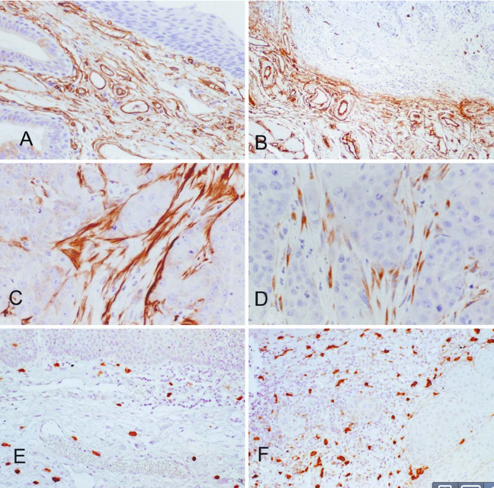
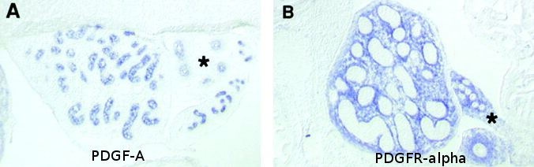

<!-- Limit image width and height -->

<!-- Center image on slide -->

<!-- Italic -->

<!-- Bold -->

--- .segue .dark .nobackground

## Recap

---

## Genoomiterviklikkuse kontroll

--- .segue .dark .nobackground

## Vähi mikrokeskkond: strooma

----

## Vähi mikrokeskkond

Kasvajarakud ei eksisteeri organismis isoleeritult, neid ümbritseb kompleksne keskkond, mis koosneb:
- normaalsetest rakkudest,
- sekreteeritud valkudest,
- füsioloogilistest madalmolekulaarsetest ühenditest (hormoonid),
- veresoontest.

--- &twocol

## Kasvajad sisaldavad suures mahus strooma rakke

***=left

***=right

<footer class="source">Pildid: 
<a href="http://onlinelibrary.wiley.com/doi/10.1002/cncr.11332/full">Gupta et al., 2003
</a>
ja 
<a href="http://onlinelibrary.wiley.com/doi/10.1002/cncr.10878/full">Wang-Rodriguez et al., 2002.
</a>
</footer>

***=pnotes
PINCH/LIMS2 on ekspresseeritud kasvajate stroomas.
- (A) Normaalne eesnääre ja (B) eesnäärme kartsinoom. 
- (C) Käärsool ja käärsoole kartsinoom. 
- (D) Käärsoole kartsinoomi suurendus, PINCH-positiivsed rakud on fibroblastoidse morfoloogiaga. 
- (E) Normaalne nahk. E, epidermis; F, karvafolliikul; D, strooma fibroblastid.  
- (F) Lamerakuline naha kartsinoom.
- (G) Kopsu adenokartsinoom.

---

## Kasvajad sisaldavad suures mahus strooma rakke

- Kõige sagedasemad vähitüübid nagu rinna, käärsoole, mao ja pankrease kartsinoomid sisaldavad kuni 90% mitte-neoplastilisi rakke.
- Hodgkinsi lümfoomis on üksikud neoplastilised tsütokiine sekreteerivad Reed-Steinbergi rakud ümbritsetud 99% normaalsetest lümfotsüütidest.

<footer class="source">Pilt: Wikimedia.
</footer>

---

## Kasvaja mikrokeskonnas resideeruvad rakutüübid

Lisaks neoplastilistele rakkudele leidub vähis erinevas proportsioonis normaalseid rakke:
- T lümfotsüüdid, B lümfotsüüdid, NK ja NKT rakud, makrofaagid (TAM), müeloidset päritolu suppressor-rakud (MDSC), dendriitrakud, neutrofiilid, fibroblastid, müofibroblastid, adipotsüüdid, endoteelirakud, peritsüüdid
lümfoid-endoteel.

<footer class="source">Pilt: 
<a href="http://dx.doi.org/10.1038/nm.3394">Quail & Joyce, 2013.
</a>
</footer>

---&twocol

## T lümfotsüüdid
# Kasvajasse infiltreeruvad erinevad T-raku populatsioonid

***=left

- T rakud lokaliseeruvad
    - kasvaja välispiirile,
    - lähimasse lümfisõlme
    - kasvaja stroomasse - tsütotoksilised T-rakud.

***=right

- CD3 positiivsed T-rakud soolevähi maksametastaaside piiril.

<footer class="source">Pilt: 
<a href="http://cancerres.aacrjournals.org/content/71/17/5670.full">Localization and Density of Immune Cells in the Invasive Margin of Human Colorectal Cancer Liver Metastases.
</a>
</footer>

---

## Kasvaja makrofaagid

<footer class="source">Pilt: 
<a href="http://www.mskcc.org/research/lab/johanna-joyce">Breast tumor-associated macrophages (TAMs).
</a>
</footer>

---&twocol

## Fibrotsüüdid, nuumrakud, silelihasrakud

***=left

- Ülemiste hingamisteede kartsinoomis on erinevat tüüpi rakke: 
    - CD34+ fibrotsüüdid (inaktiivsed fibroblastid) normaalses (A) ülemiste hingamisteede stroomas ja kartsinoomi (üleval paremal) ümbritsemas (B).
    - $\alpha$-SMA+ silelihasrakud (C) ja CD117+ nuumrakud (D) vähi stroomas.
    - CD117+ nuumrakud normaalses stroomas (E) ja kartsinoomis (F).

***=right

<footer class="source">Pilt: 
<a href="http://link.springer.com/content/pdf/10.1007/s00428-003-0965-1.pdf">Barth et al., 2004.
</a>
</footer>

---
## Mis põhjustab erinevate normaalsete rakutüüpide olemasolu kasvajas
# Kuidas saab moos kommi sisse?

- Vähis olevad normaalsed rakud on jäänukid algsest koest enne tumorigeneesi algust.
- Normaalsete rakkude viibimine kasvajas on tingitud **heterotüüpsest signalisatsioonist**.

---

## Heterotüüpne ligand-retseptor signalisatsioon

- Erinevate rakutüüpide vahelist signaliseerimist nimetatakse **heterotüüpseks signalisatsiooniks**.
- Heterotüüpne signalisatsioon soodustab või pidurdab kõrvalolevate teiste rakutüüpide jagunemist ja/või ellujäämist.
- Näiteks: soole epiteelirakud ekspresseerivad **c-MET retseptorit** aga soole mesenhüüm selle ligandi **HGF/SF kasvufaktorit**. 

<footer class="source">Pilt: Retsiprookne PDGF-A ja PDGFR-a ekpsressioon testistes. PDGF-A-d ekspresseerivad tubulaarse epiteeli rakud ja PDGF-R ekspresseerivad mesenhümaalsed rakud. 
<a href="http://jcb.rupress.org/content/149/5/1019.full"> Gnessi et al., 2000.
</a>
</footer>

---

## Kasvajarakud kontrollivad stroomat

- Heterotüüpne signalisatsioon põhineb 
    - mitogeensetel kasvufaktoritel (HGF/SF, VEGF, TGF-$\alpha$, PDGF),
    - kasvu inhibeerivatel signaalidel (TGF-$\beta$),
    - troofilistel faktoritel mis vahendavad eelkõige ellujäämist (*insulin-like growth factor-1/2*, IGF-1/2).
- **Sarnaselt normaalse epiteeliga kontrollivad ka kartsinoomi rakud ümbritsevaid normaalseid kudesid indutseerides neid kasvama**.
- Teistpidi, strooma rakud võivad signaliseerida vähirakkudele ka kasvu pidurdavalt.

---

## Heterotüüpsed interaktsioonid mängivad rolli vähi tekkel ja arengus

- Krooniliste põletike korral toimivad strooma rakud nagu makrofaagid, neutrofiilid ja lümfotsüüdid vähi teket soodustava faktorina kuna loovad pro-inflammatoorse keskkonna (sekreteerivad  TNF-$\alpha$ ja prostaglandiine).
- Kartsinoomi rakud sekreteerivad PDGF-i, mille retseptorid on ekspresseeritud strooma rakkudel - fibroblastid, müofibroblastid ja makrofaagid. Strooma rakud sekreteerivad vastusena PDGF-ile IGF-1, mis omakorda soodustab vähirakkude kasvu ja ellujäämist.
- Melanoomid sekreteerivad samuti PDGF-i, mis indutseerib fibroblastidel IGF-2 sekretsiooni.
- Rinnavähi rakud sõltuvad strooma fibroblastide poolt sekreteeritud CXCL12 kemokiinist ja HGF/SF-st. 

---&twocol

## Vähiraku liinide ksenograftid hiires erinevad reaalsetest kasvajatest 

***=right

Patient-derived xenograft (PDX) models of colorectal cancer recapitulate primary tumor heterogeneity. Hematoxylin and eosin (H&E) stained FFPE slides of xenografts generated by traditional HT-29 (a) or SW480 (b) colorectal cancer cell lines, vs a primary colorectal tumor, SCRX-PDX-CR101-p0 (c), and the same patient’s PDX tumor following passaging through NOD/SCID mice, SCRX-PDX-CR101-p1 (d). Note the relative uniformity of the HT-29 and SW480 tumors relative to the primary or PDX tumor following minimal passaging in immunocompromised mice.

***=left

<footer class="source">Pilt: 
<a href="http://www.nature.com/labinvest/journal/v93/n9/full/labinvest201392a.html">Williams et al., 2013.
</a>
</footer>

--- &twocol

## Kasvaja fibroblastid (CAF)
# CAF-id on kõige suurearvulisem vähi strooma rakutüüp tahketes kasvajates

***=right

- Normaalselt, koe kahjustuste korral diferentseeruvad fibroblastid müofibroblastideks(=CAF).
- CAF-id võivad olla erinevat päritolu ja diferentseeruda ka 
    - endoteelist (endothelial-to-mesenchymal transition),
    - silelihasrakkudest,
    - müoepiteelist või
    - mesenhümaalsetest tüvirakkudest.

***=left

<footer class="source">Pilt: 
<a href="http://www.sciencedirect.com/science/article/pii/S1044579X14000054">TGF-beta in CAF-mediated tumor growth and metastasis.
</a>
</footer>

---

## Kasvaja fibroblastid

Indutseerivad ja soosivad tuumori kasvu, angiogeneesi, põletikku ning metastaase
- Sekreteerivad tervet rida pro-tumorigeenseid kasvufaktoreid, sh. HGF, FGF-e, CXCL12 ja TGF-$\beta$.
- **TGF-$\beta$ roll**: vähirakkudes on kas inaktiveerinud kogu TGF-$\beta$ rada või on inaktiveeritud p15 geen CDKN2B.
      - Kolorektaalvähis on TGF-$\beta$ ekspressioon nihkunud epiteeli rakkudelt strooma rakkudele ja CAF-idele. 
      - Epiteelirakud ekspresseerivad märksa vähem p-SMAD2/3 võrreldes strooma rakkudega või pre-maliigses koes olevate epiteelirakkkudega.

---

## TGF-$\beta$ signalisatsioon muudab fibroblastid CAF-ideks 

<footer class="source">Pilt: Interaction with colon cancer cells hyperactivates TGF-β signaling in cancer-associated fibroblasts.
<a href="http://www.nature.com/onc/journal/v33/n1/full/onc2012536a.html">Hawinkels et al., 2014.
</a>
</footer>

---

## Vähi veresooned

- Kasvaja angiogeneesi paradigma: tahked kasvajad ei saa areneda üle 1 mm suuruse ilma angiogeneesi initsieerimata
- Mitmed KMK-s esinevad kasvufaktorid ja hüpoksia indutseerivad veresoonte kasvu
    - VEGF, bFGF, HGF, PDGF

---

## Vähi veresooned

- Kasvaja veresooned on heterogeense luumeniga, lekkivad ja ebakorrapärased

---

## Vähi versoonte klassifikatsioon

Soone tüüp |  Soone omadused | VEGF-A sõltuvus
-----------|-----------------|----------------
Emasoon, *mother vessel* (MV) |	Suured, õhukeseseinalised, hüperpermeabiilsed, kergelt fenestreeritud peritsüütide vaesed sinusoidid mis on pungil täis erütrotsüüte |	+
Kapillaarid |	Moodustuvad MV-dst sisemise jagunemise teel	| −
Glomeruloidsed mikrovaskulaarsed proliferatsioonid | Väheorganiseerunud vaskulaarsed struktuurid. Sisaldavad endoteelirakke ja peritsüüte. Minimaalse luumeni ja iseloomulikult rikkaliku mitmekihilise basaalmembraaniga |	+
Vaskulaarsed väärmoodustised *malformations*	| MV-d mis ebasümmeetriliselt kaetud silelihasrakkudega ja/või fibroosse sidekoega. Sarnased arterio-venoossete väärmoodustistega.	|	−
Toitja-arterid ja äravoolu veenid |	Suurenenud, väljaveninud struktuurid, moodustunud olemasolevatest arteritest ja veenidest. Väljuvad vähimassist radiaalselt, toidavad ja dreenivad vähi massis olevaid sooni. |	−
Vaskulaarne mimikri | Verega täidetud tuumoris olevad avavused mida ümbritsevad vähirakud. |

---

## Rakuväline maatriks (ECM)

- vähile on iseloomulik dereguleeritud ECM-i dünaamika MMP-d, plasmin
- protelüütline aktiivsus pärit kasvajas resideeruvatest stroomarakkudest sh. TAM-d, CAF-d
- erinevaid kollageene kasvajates oluliselt rohkem
- kasvajad sellest tingituna füüsiliselt jäigemad
- üle-ekspresseeritud proteoglükaanid, CD44: kasvufaktorite presenteerimine

---

## ECM-i arhitektuur on kasvajates oluliselt erinev normaalsest stroomast

- kollageen-I: normaalselt mitte-orienteeritud fibrillide asemel on kollageen rinnakasvajates selgelt lineaarselt orienteeritud
- kasvaja stroomas kollageeni fiibrid tugevalt krosslingitud: lüsüüloksüdaasid (LOX, LOX-like 2)
- krosslingitud ja tugevam maatriks indutseerib EC migratiooni ja angiogeneesi Bignon et al. (2011)

---

## Veresooned kasvavad piki FN maatriksit

---

## 
